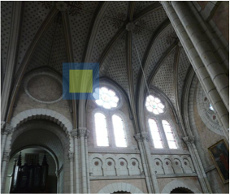
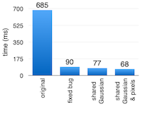

# Homework 1: Optimizing Gaussian Blur

For this assignment you will optimize a CUDA kernel that uses a [Gaussian blur](https://en.wikipedia.org/wiki/Gaussian_blur) filter to blur a high-resolution image. After transferring the image to the GPU, the filter is applied via a CUDA kernel and the output image is transferred back to the CPU to be saved to disk. Note that loading the image into memory and writing it to disk is slow: several seconds each on my virtual machine. By comparison, CPU-GPU memory transfers and kernel execution are all generally less than a second.

Your goal is to accelerate the original kernel by a factor of **about 38x**, through the series of optimizations below. 


## Code overview

The blur operation occurs in the `blurGlobal` kernel. This kernel is setup so that each thread is responsible for computing the blurred value of a single pixel. Because the image is 2D, the grid is a 2D collection of 2D thread blocks. Since the maximum number of threads per block for our GPUs is 1024, each block is a 32x32 collection of threads. The number of blocks in the grid depends on the image size, but you can assume that the image is *always divisible into an integral number of blocks along both the x and y dimensions*.

To compute the blurred value for a given pixel, the values of 224 (=15<sup>2</sup> - 1) surrounding pixels need to be read and weighted according to a Gaussian distribution. At the edges of the image, some of these surrounding pixels reside "outside" the image. In this case, the kernel fills in the edge pixel value for any "outside" pixel. This is accomplished by the `clamp` function.

The input and output image buffers are 2D buffers allocated using *pitched memory*. The Nvidia CUDA Programming Guide has a good section on [pitched memory](http://docs.nvidia.com/cuda/cuda-c-programming-guide/index.html#device-memory). Pitched memory is like a normal 2D C array (where rows are laid out contiguously in memory) except that there may be some extra padding at the end of each row to ensure that the first element of each row is aligned to a 128B boundary for optimal global memory coalescing. This padding needs to be taken into account when indexing into pitched memory.

The code also measures the latency of memory transfers to/from the GPU, as well as the execution time of the kernel itself. Use these measurements to check your progress in optimizing the code.

There are two input images provided in the repo's `hw1` directory. `steel_wool_large.bmp` is the standard input, used in the performance measurements below. `steel_wool_small.bmp` is a much smaller input that runs about 15x faster and is useful during debugging. The input image is hard-coded into the `main()` function for simplicity. Feel free to change this to a command-line parameter if you want.

## Part 0: Benchmark the original code

Run the original code to record the running time of the `blurGlobal` kernel on the large input.


## Part 1: Fix performance bug in blurGlobal

The initial version of the `blurGlobal` kernel has a performance bug in it. Once you find the bug, the fix is simple: just two lines need to change, with no new code. Use the Nsight profiling tools to help you narrow in on the cause.


## Part 2: Move Gaussian array to shared memory

The array holding the Gaussian filter weights is stored in global memory. However, it is accessed very frequently by the kernel, and the values are the same for every thread in a block. So, let's move the Gaussian array into shared memory to improve performance. Write a new kernel `blurGlobalSharedGaussian` that does this. Note that you don't need to recompute the Gaussian array from scratch; you can just copy over its values into shared memory.

My implementation of `blurGlobalSharedGaussian` added about 5 lines of new code to `blurGlobal`.

This [Nvidia tutorial on shared memory](https://devblogs.nvidia.com/parallelforall/using-shared-memory-cuda-cc/) is a good resource. You'll want to use *static shared memory*. Note that shared memory allows for the construction of 2D (or, indeed, n-dimensional) arrays just like in regular C/C++ code, to simplify your array indexing:

```cuda
__shared__ float sharedGaussian[FILTER_SIZE][FILTER_SIZE];

sharedGaussian[i][j] = 1.0;
```

Note that shared memory is **not automatically initialized**. You'll need to initialize the values of `sharedGaussian` from global memory before you can use `sharedGaussian` to compute the blur. For testing, you can have just one thread from each block initialize the `sharedGaussian` array. However, to match our performance results you'll need to have all threads within the block cooperate to initialize `sharedGaussian` in parallel.


## Part 3: Cache input pixels in shared memory

The pixels of the source image are also frequently reused by different threads within a block, so let's move them there, too! This is the most involved optimization by far. My implementation added about 34 lines of new code. Add a new kernel `blurGlobalSharedPixels` that does this.

You can use static shared memory for the input pixels, as the block dimensions and filter size are fixed.

The basic idea of this optimization is to load a "tile" of input pixels from global memory into shared memory, and use those to compute the blur. The tile needs to be large enough to hold all the input pixels that a block will need:

```cuda
__shared__ int sharedPixels[BLOCKDIM+FILTER_SIZE][BLOCKDIM+FILTER_SIZE];
```

The diagram below shows an [input image](https://commons.wikimedia.org/wiki/File:Langeais_%C3%A9glise_%286%29.JPG), a yellow square identifying the blurred output pixels generated by a block, and a larger blue square representing input pixels that must be read to calculate the blur. Keeping the dimensions of everything straight is the main challenge of implementing this optimization. Note also that you'll need to initialize your `sharedPixels` array *in parallel* to match the performance of our implementation.




## Performance results

Here are the performance results I got for the initial code and parts 1-3, running on the `steel_wool_large.bmp` input on an AWS `g4dn.xlarge` instance in November 2022. Your results will likely differ a bit, but this is a guide as to what you should expect from each optimization. I found run-to-run variance to be pretty low, typically <1ms.




## Performance hints

The Nsight profiler is your friend :-). Look out for poor global memory coalescing (multiple transactions per request) and shared memory bank conflicts. The Nsight memory experiments give insight into both of these issues.


## Correctness

All versions of the code should compute exactly the same final image. The
program automatically compares your kernels' output to a reference image from
our code, and reports the number of pixels that differ and the root-mean-square
difference (RMSD) in the pixels' values. Your code doesn't have to be perfect,
but it should produce images that have a **RMSD ≤1.0** with respect to the reference image.


## What to turn in

Via Canvas, submit 1) your `blur.cu` file with your 3 kernels in it and 2) a short write-up document (as a PDF file). The write-up should include the following:

1. Why do you think fixing the bug in Part 1 has such a huge impact on performance? Give your answer in 2-3 sentences.

2. Why do you think that moving the Gaussian to shared memory has such a small impact on the kernel's performance? Give your answer in 2-3 sentences.

3. Why do you think that moving the input pixels to shared memory has such a sizable impact on the kernel's performance? Give your answer in 2-3 sentences.

4. Include a graph (like the one above) showing your performance results for the four versions of the code (original and Parts 1-3).
